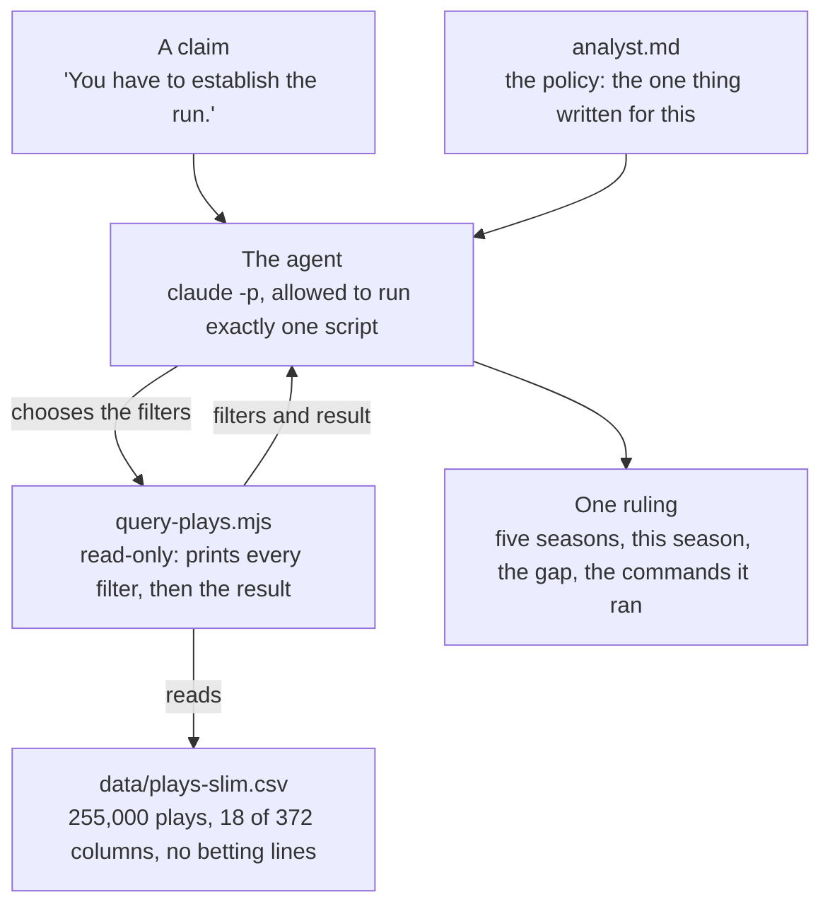
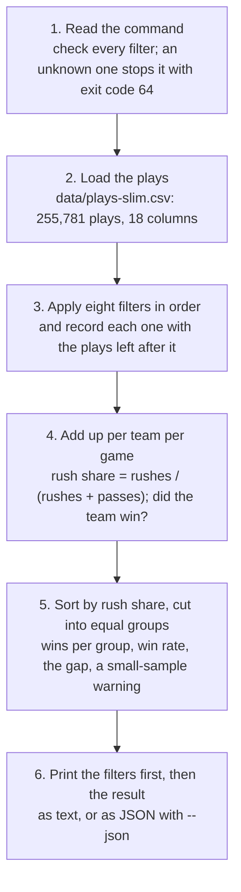

# The Monday Morning Agent

An agent that checks the tape. A football argument goes in; a ruling comes out, with
every filter it applied on screen.

This is the repo behind [The Monday Morning Agent](https://www.oreilly.com/live-events/the-monday-morning-agent/0642572456054/),
an eight-episode O'Reilly live series hosted by Chester Ismay. Each episode settles one
argument NFL fans cannot stop having and adds one skill to the agent. One folder per
episode.

- **The series, all eight arguments:** https://ismayc.github.io/monday-morning-agent/
- **Episode 1, the short version with no code:** https://ismayc.github.io/monday-morning-agent/episode-1/
- **The plays, row by row, and the cut from 372 columns to 18:** https://ismayc.github.io/monday-morning-agent/episode-1/plays.html
- **Change a filter yourself, nothing to install:** https://ismayc.github.io/monday-morning-agent/episode-1/explorer.html
- **How the one tool works, as a diagram:** https://ismayc.github.io/monday-morning-agent/episode-1/tool.html

## Episode 1: "You have to establish the run."

One agent, one read-only data tool, every filter shown. Everything is in `episode-1/`.



| File | What it is |
|---|---|
| `analyst.md` | The policy: eight sections, about 700 words. Who the agent is, its one tool, how to turn a claim into a question, answer it twice, show every filter, what it may not say, the shape of the ruling, the allowlist |
| `analyst-outline.md` | The same file with only its eight headings: what the episode starts from and fills in on air, and the place to start your own |
| `query-plays.mjs` | The one tool. Sorts every team's game by the share of its plays that were runs, cuts them into equal groups, and reports each group's win rate under the filters given. `node ./query-plays.mjs --help` lists the filters |
| `run-analyst.sh` | The runner: `claude -p` with your claim as the prompt, the policy as the system prompt, and a one-line allowlist |
| `show-run.mjs` | Turns the agent's event stream into what you see: each tool call with its filters and result as it lands, then the ruling |
| `render-run.mjs` | Writes the same run as one page, `rulings/run-<stamp>.html`: the ruling first, then each call down a clock with its filters as a funnel and its result as a table and a bar. The runner opens it when the run ends; `node ./render-run.mjs rulings/run-<stamp>.jsonl` rebuilds it for an older run |
| `season-sheet.mjs` | The answer on one page: asks the tool eight questions for a set of seasons (whole game, each half, close games, the regular season, the playoffs) and writes them as one sheet with a verdict on the claim, by a rule printed on the page. `--seasons 2026` for this season, `--open` to open it, `--out` to put it anywhere. Written to `rulings/` by default, so a sheet is not public until it is published on purpose |
| `data/plays-slim.csv` | The plays: 2021 through 2025 complete, 2026 as far as it has been published |
| `slim-data.mjs`, `fetch-data.sh` | How that file is made: download the seasons from nflverse, keep 18 columns |
| `fetch-espn.mjs` | The fallback for this season: when nflverse has not yet published a game that has been played, fills it from ESPN's game summaries in the same 18 columns, and only until nflverse has it. `fetch-data.sh` runs it; `--check` only reports |
| `build-explorer-data.mjs` | Asks the tool every question the explorer page's buttons can ask and saves the answers |
| `build-plays-data.mjs` | Describes the plays file for the page that reads it: every column in the download with the kept ones and the betting lines marked, the counts, and every play of the latest week's games |
| `examples/` | A tool read (text and JSON), the policy, and a ruling on a claim the tool cannot answer. The rulings on the episode's claim, with one run as it looked on screen and a bet the agent declined, go up here after the episode airs on October 12, 2026 |
| `rehearse.sh` | `tool`, `claims`, `verify`, `freeze`: the rehearsal beats as subcommands |

### How `query-plays.mjs` works

It is 204 lines of JavaScript (an ES module, hence `.mjs`), run by Node.js. It imports
only what ships with Node (`node:fs`, `node:path`, `node:url`), so there is nothing to
install. It reads one file and prints; it never writes and never goes online.



For `--seasons 2021-2025 --half 1`, stage 3 goes from 255,781 plays to 87,209; stage 4
finds 2,840 team-games; stage 5 cuts them into four groups of 710. The page linked above
follows that command through every stage.

### Run it

You need Node, git, and the [Claude Code CLI](https://claude.com/claude-code), signed in.
The data is in the repo.

```
git clone https://github.com/ismayc/monday-morning-agent.git
cd monday-morning-agent/episode-1

# the tool on its own: whole game, then first half only
node ./query-plays.mjs --seasons 2021-2025
node ./query-plays.mjs --seasons 2021-2025 --half 1

# the agent, with any claim about running the ball
./run-analyst.sh "You have to establish the run."
```

A run takes about 15 seconds and makes four tool calls for that claim. The ruling is
saved under `rulings/`, and the whole run opens in your browser as one page when it
ends (`ANALYST_NO_OPEN=1` writes the page without opening it). To refresh this season
yourself: `./fetch-data.sh 2026`.

### What the numbers say

Five seasons, the teams that ran most against the teams that ran least:

| Filter | Ran most | Ran least | Gap |
|---|---|---|---|
| Whole game | 77.7% | 19.2% | 58.6 points |
| First half only | 53.0% | 46.1% | 6.9 points |
| Second half only | 87.0% | 11.7% | 75.4 points |

Running early and running late tell two different stories. Which one the agent ruled
on, and why, is given on the episode on October 12, 2026, and goes up here afterward.
One filter changes the story, which is why the tool prints every filter and the policy
makes the agent read them.

## What this agent does not do

No predictions, no odds, no wagering analysis, and no fantasy advice. That is a design
decision. The public data carries betting-line columns; `slim-data.mjs` does not keep
them, so the file the agent can reach has none.

## A scheduled workflow commits to `main`

`.github/workflows/refresh-data.yml` is scheduled three times a night (GitHub starts
scheduled workflows hours late, so one slot is not enough; the file says why). It
re-downloads the seasons, rebuilds the slim file, the explorer page's answers, and the
plays page's data, and commits when the plays changed. Pull before you push.

## Data

Play-by-play data is from [nflverse](https://github.com/nflverse/nflverse-data),
licensed [CC BY 4.0](https://creativecommons.org/licenses/by/4.0/). The file here is a
cut of it: 18 of 372 columns, seasons 2021 through 2026. nflverse rebuilds its file
several times a day in season, so a Sunday game is normally there by Monday morning; for
the morning it is not, `fetch-espn.mjs` fills the missing games from ESPN's public game
summaries on your own machine (the committed file is nflverse only). Measured on all 16
Week 4 games of 2026: the two sources agree on a team's runs and passes within three
plays, and on rush share within 1.15 points.

The site is `docs/`: the series page at the root and one folder per episode
(`docs/episode-1/`), all sharing `docs/sheet.css` and the icons. The link-preview images
and the icons are rendered from the `og-image.html` beside each image and from
`docs/apple-touch-icon.html`; each file's first
comment has the command (serve `docs/` locally first, since the preview source loads
the stylesheet and fonts).
