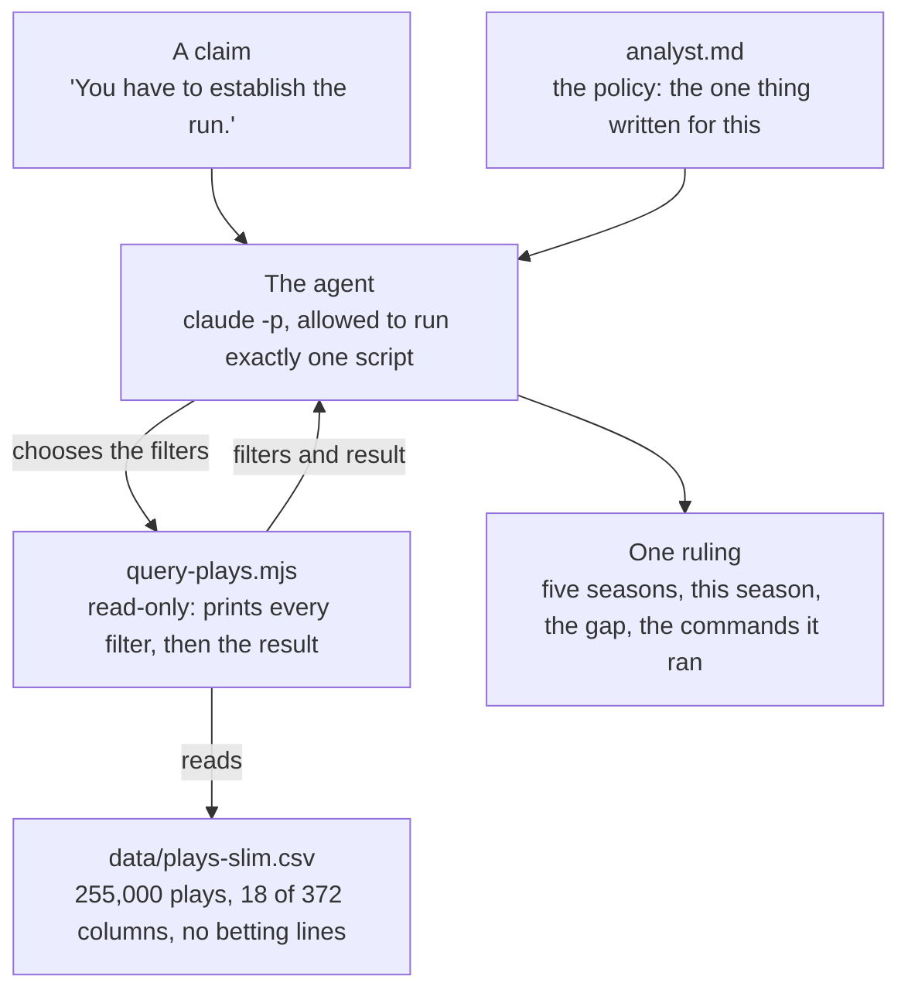

# The Monday Morning Agent

An agent that checks the tape. A football argument goes in; a ruling comes out, with
every filter it applied on screen.

This is the repo behind [The Monday Morning Agent](https://www.oreilly.com/live-events/the-monday-morning-agent/0642572456054/),
an eight-episode O'Reilly live series hosted by Chester Ismay. Each episode settles one
argument NFL fans cannot stop having and adds one skill to the agent. One folder per
episode.

- **The short version, no code:** https://ismayc.github.io/monday-morning-agent/
- **Change a filter yourself, nothing to install:** https://ismayc.github.io/monday-morning-agent/explorer.html

## Episode 1: "You have to establish the run."

One agent, one read-only data tool, every filter shown. Everything is in `episode-1/`.



| File | What it is |
|---|---|
| `analyst.md` | The policy: eight sections, about 700 words. Who the agent is, its one tool, how to turn a claim into a question, answer it twice, show every filter, what it may not say, the shape of the ruling, the allowlist |
| `query-plays.mjs` | The one tool. Sorts every team's game by the share of its plays that were runs, cuts them into equal groups, and reports each group's win rate under the filters given. `node ./query-plays.mjs --help` lists the filters |
| `run-analyst.sh` | The runner: `claude -p` with your claim as the prompt, the policy as the system prompt, and a one-line allowlist |
| `show-run.mjs` | Turns the agent's event stream into what you see: each tool call with its filters and result as it lands, then the ruling |
| `data/plays-slim.csv` | The plays: 2021 through 2025 complete, 2026 as far as it has been published |
| `slim-data.mjs`, `fetch-data.sh` | How that file is made: download the seasons from nflverse, keep 18 columns |
| `build-explorer-data.mjs` | Asks the tool every question the explorer page's buttons can ask and saves the answers |
| `examples/` | A tool read (text and JSON), the policy, one run as it looked on screen, and three rulings: the episode's claim, a bet it declined, and a claim the tool cannot answer |
| `rehearse.sh` | `tool`, `claims`, `verify`, `freeze`: the rehearsal beats as subcommands |

### Run it

You need Node, git, and the [Claude Code CLI](https://claude.com/claude-code), signed in.
The data is in the repo.

```
git clone https://github.com/ismayc/monday-morning-agent.git
cd monday-morning-agent/episode-1

# the tool on its own: whole game, then first half only
node ./query-plays.mjs --seasons 2021-2025
node ./query-plays.mjs --seasons 2021-2025 --half 1

# the agent, with any claim about running the ball
./run-analyst.sh "You have to establish the run."
```

A run takes about 15 seconds and makes four tool calls for that claim. The ruling is
saved under `rulings/`. To refresh this season yourself: `./fetch-data.sh 2026`.

### What the numbers say

Five seasons, the teams that ran most against the teams that ran least:

| Filter | Ran most | Ran least | Gap |
|---|---|---|---|
| Whole game | 77.7% | 19.2% | 58.6 points |
| First half only | 53.0% | 46.1% | 6.9 points |
| Second half only | 87.0% | 11.7% | 75.4 points |

Running early goes with a small edge. Running late goes with an enormous one, because
teams that are ahead run to use the clock. One filter changes the story, which is why
the tool prints every filter and the policy makes the agent read them.

## What this agent does not do

No predictions, no odds, no wagering analysis, and no fantasy advice. That is a design
decision. The public data carries betting-line columns; `slim-data.mjs` does not keep
them, so the file the agent can reach has none.

## A scheduled workflow commits to `main`

`.github/workflows/refresh-data.yml` runs daily, re-downloads the seasons, rebuilds the
slim file and the explorer page's answers, and commits when the plays changed. Pull
before you push.

## Data

Play-by-play data is from [nflverse](https://github.com/nflverse/nflverse-data),
licensed [CC BY 4.0](https://creativecommons.org/licenses/by/4.0/). The file here is a
cut of it: 18 of 372 columns, seasons 2021 through 2026.

The link-preview image and the icons are rendered from `docs/og-image.html` and
`docs/apple-touch-icon.html`; each file's first comment has the command.
